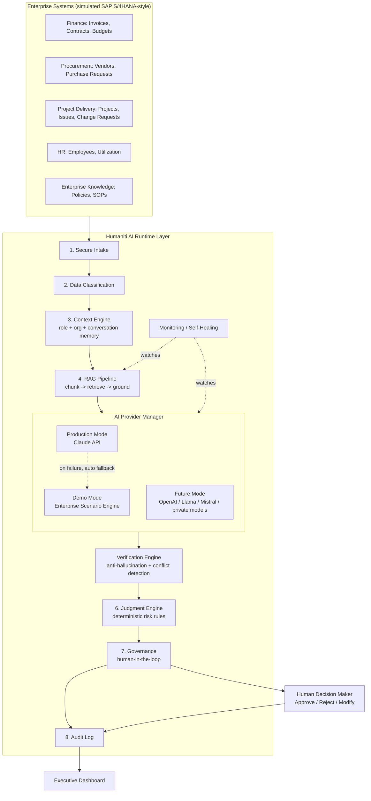

# Architecture — Humaniti AI Runtime Layer™

## Positioning

Not an "ERP AI assistant" (crowded, low-credibility market). This is an **AI Runtime
Governance Layer**: infrastructure that sits between enterprise systems and any AI
model, so that AI reasoning over enterprise data is grounded, risk-classified,
escalated correctly, and auditable — regardless of which model is doing the reasoning.

## System diagram

### AI Provider Abstraction

The runtime layer owns context management, retrieval, governance, validation, risk
scoring, and auditability. **The AI model only supplies reasoning capability** — it is
interchangeable, not load-bearing. `AIProviderManager` (in
`humaniti_backend_runtime_engine.py`) enforces this split:

- **`AI_MODE=production`** — every request is sent to the Claude API with validated
  enterprise context; the response runs through hallucination checks, confidence
  scoring, policy validation, and risk classification before it reaches governance.
- **`AI_MODE=demo`** — no external API is ever called. A controlled Enterprise Scenario
  Engine reasons over the same simulated ERP data using the same deterministic
  Judgment Engine rules, so stakeholder demos work with zero API credits, zero network
  dependency, and fully predictable output.
- **`AI_MODE=auto`** (default) — behaves like production when `ANTHROPIC_API_KEY` is
  set, demo otherwise.
- **Automatic fallback** — if the Claude API call fails for any reason (invalid key,
  no credits, timeout, network outage), `AIProviderManager` catches it, logs the
  failure to the Health Monitor with a suggested fix, and transparently reroutes the
  same request to the Enterprise Scenario Engine. The workflow completes; the runtime
  never crashes and never leaves a request unanswered. This is exercised directly by
  `test_api_unavailable_triggers_fallback` and `test_invalid_or_missing_api_key_graceful_failure`
  in `humaniti_backend_tests.py`.
- **Model transparency** — every response carries `ai_mode` (`production` / `demo` /
  `demo-fallback`), `reasoning_source` (`Claude API` or `Enterprise Scenario Engine`),
  a `confidence` score, `sources`, and `human_action_required`, so nobody in the room
  has to guess which engine answered.
- **Low-confidence escalation** — a response below 40% confidence is never left as a
  plain informational answer; it's automatically escalated to `requires_human_review`.
- **Adding a provider later** (OpenAI, Llama, Mistral, a private enterprise model) means
  writing one more class that implements `ReasoningProvider.reason()` and registering it
  in `AIProviderManager` — nothing in the context, retrieval, judgment, governance, or
  audit layers changes.

The standalone demo (`humaniti_ai_runtime_layer_demo.html`) mirrors this exact design
client-side: a **Runtime Settings → AI Mode** selector (Auto / Production / Demo
Simulation), a matching Enterprise Scenario Engine implemented in JavaScript, and the
same automatic-fallback banner behavior — so a flaky venue Wi-Fi never derails a live
pitch.

## Why each layer exists (and which known AI-tool failure it fixes)

| Layer | Failure mode it fixes | How |
|---|---|---|
| Context Engine | Same answer regardless of who's asking; no memory | Role-based permissions + bounded conversation memory attached to every call |
| RAG Pipeline | Context-window limits on large enterprise docs | Chunking (`chunk_text`) + scored retrieval (`RAGPipeline.retrieve`); swap in pgvector embeddings without touching callers |
| Reasoning Engine | Hallucination, stale/general "knowledge cutoff" reasoning | System prompt forces evidence-only answers from the CONTEXT block, not training data |
| Verification Engine | Overconfident answers, fabricated citations, silent conflicts | Pre-check refuses to call the model with zero evidence; post-check strips uncited/fabricated sources and downgrades confidence; flags conflicting documents instead of silently picking one |
| Judgment Engine | AI can't distinguish recommend vs. execute | Deterministic Python rules (not the LLM) decide LOW/MEDIUM/HIGH; reconciliation always takes the *more conservative* of rule-based and model-reported risk |
| Governance | No accountability for what AI recommended vs. what a human decided | HIGH-risk items are hard-gated to `requires_human_review`; approve/reject/modify is recorded against the same audit record |
| Audit Log | No trace of what AI saw, said, or who acted on it | Every interaction: user, role, query, sources used, AI output, confidence, human decision, timestamps |
| Health Monitor | Silent failures | Every Claude API failure is logged with a suggested fix; health score exposed on the dashboard |

## Tech stack

- **Frontend:** React + Tailwind (scaffold in `frontend/`), plus the standalone demo HTML for zero-install stakeholder walkthroughs.
- **Backend:** Python, FastAPI.
- **Database:** PostgreSQL + `pgvector` (docker-compose brings this up; the reference build uses in-memory/keyword retrieval so it runs with zero external services for review).
- **AI:** Claude API (`anthropic` SDK), model configurable (`claude-sonnet-5` default).
- **Infra:** Docker, environment-variable config, modular services designed for AWS deployment (ECS/Fargate + RDS Postgres + pgvector is the natural target).

## Responsible AI principles applied (Anthropic AI Fluency-aligned)

- **Understand before acting** — Context Engine resolves who's asking and what they're authorized to see *before* any reasoning happens.
- **Use judgment, know uncertainty** — every response carries a confidence score and an explicit "I don't have enough verified information" fallback; the system is designed to say "I don't know" rather than guess.
- **Collaborate with humans** — HIGH-risk actions are structurally incapable of being auto-approved; the human decision is captured against the same audit record as the AI's recommendation.
- **Explain reasoning** — every response includes a "reasoning" field grounded in cited sources, not just a verdict.
- **Avoid overconfidence** — the Verification Engine actively downgrades confidence when the model cites something it shouldn't, rather than trusting the model's self-reported confidence at face value.
- **AI as partner, not replacement** — the system is architected so recommendations flow to a human decision-maker, and that decision — not the AI's output — is what's authoritative in the audit trail.
